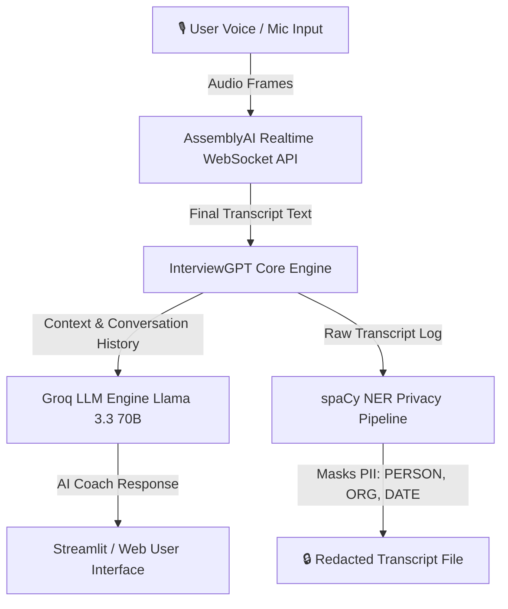

<div align="center">

  <h1>🧠 InterviewGPT V2</h1>
  <p><strong>Next-Generation Real-Time AI Interview Assistant & Personal Coach</strong></p>

  <p>
    <a href="https://huggingface.co/spaces/MukulDhanjal/InterviewGPT">
      
    </a>
    <a href="https://github.com/MukulDhanjaler/InterviewGPT/stargazers">
      
    </a>
    <a href="https://github.com/MukulDhanjaler/InterviewGPT/network/members">
      
    </a>
    <a href="https://github.com/MukulDhanjaler/InterviewGPT/blob/main/LICENSE">
      
    </a>
  </p>

  <p>
    <a href="#-live-demo">Live Demo</a> •
    <a href="#-key-features">Features</a> •
    <a href="#-architecture">Architecture</a> •
    <a href="#-getting-started">Quick Start</a> •
    <a href="#-tech-stack">Tech Stack</a> •
    <a href="#-privacy--security">Privacy</a>
  </p>

  ---
</div>

> [!TIP]
> **Experience InterviewGPT Online Now!**  
> Access the free live web application hosted on Hugging Face Spaces:  
> 👉 **[https://huggingface.co/spaces/MukulDhanjal/InterviewGPT](https://huggingface.co/spaces/MukulDhanjal/InterviewGPT)**

---

## 🌟 Overview

**InterviewGPT V2** is an intelligent, real-time audio transcription and AI-powered interview preparation suite. Designed for job seekers, tech professionals, and students, InterviewGPT listens to your voice during practice rounds or mock interviews, generating instant contextual feedback, answers, and critique powered by ultra-fast LLM inference.

Whether preparing for **behavioral STAR-method questions**, **technical coding rounds**, or **system design interviews**, InterviewGPT acts as your co-pilot to elevate your communication and technical accuracy.

---

## ✨ Key Features

- 🎙️ **Real-Time Voice Streaming**: Low-latency audio transcription via AssemblyAI WebSocket connection.
- ⚡ **Ultra-Fast AI Responses**: High-speed, high-quality response generation using Groq's `Llama-3.3-70b-versatile` engine.
- 🎯 **Multi-Mode Coaching**:
  - **Behavioral Mode**: Guides responses using the **STAR** (Situation, Task, Action, Result) framework.
  - **Technical Mode**: Practice Data Structures, Algorithms, and System Design problems.
  - **Mock Interviewer Mode**: End-to-end interactive mock interviews tailored to top tech roles.
- 🛡️ **Differential Privacy & PII Masking**: Integrated `spaCy` Named Entity Recognition (NER) to automatically detect and mask sensitive Personal Identifiable Information (Names, Phone Numbers, Organizations, Dates) in saved transcripts.
- 🔐 **Secure Access**: Integrated user authentication utilizing PBKDF2 hashed credentials via `streamlit-authenticator`.
- 🌐 **Cross-Platform & Web Ready**: Flexible architecture supporting full local audio streaming (PyAudio) and lightweight online cloud deployments (Web UI).

---

## 📹 Video Demo

Click the preview below to watch the application in action:

<div align="center">
  <a href="https://youtu.be/26__rpg5AvA" target="_blank">
    
  </a>
</div>

---

## 🏗️ Architecture



---

## 🛠️ Tech Stack

| Domain | Technology / Library | Description |
| :--- | :--- | :--- |
| **Frontend UI** | Streamlit, HTML5/CSS3/JS | Responsive interactive dashboard |
| **Speech-to-Text** | AssemblyAI WebSocket API | Low-latency real-time voice streaming |
| **LLM Inference** | Groq API (`llama-3.3-70b-versatile`) | Instant AI feedback generation |
| **NLP & Privacy** | spaCy (`en_core_web_sm`) | Named Entity Recognition for PII redaction |
| **Authentication** | Streamlit Authenticator | PBKDF2 password hashing & session auth |
| **Data & Viz** | Pandas, Plotly Express | Analytics and session metric visualization |

---

## 🚀 Getting Started

### Prerequisites

- Python 3.9 or higher
- [Groq API Key](https://console.groq.com) (Free tier available)
- [AssemblyAI API Key](https://www.assemblyai.com) (Free tier available)

### Installation

1. **Clone the Repository**
   ```bash
   git clone https://github.com/MukulDhanjaler/InterviewGPT.git
   cd InterviewGPT
   ```

2. **Create a Virtual Environment**
   ```bash
   python3 -m venv venv
   source venv/bin/activate  # On Windows: venv\Scripts\activate
   ```

3. **Install Dependencies**
   ```bash
   pip install -r requirements.txt
   pip install pyaudio   # Required for local microphone capture
   python -m spacy download en_core_web_sm
   ```

4. **Configure API Keys**
   Set your API keys in your environment variables:
   ```bash
   export GROQ_API_KEY="your_groq_api_key"
   export ASSEMBLY_AI_API_KEY="your_assemblyai_api_key"
   ```
   *(On Windows PowerShell, use `$env:GROQ_API_KEY="your_key"`)*

5. **Launch the Application**
   ```bash
   streamlit run app.py
   ```

> **Default Authentication**: `mukul` / `mukul` or `vaddi` / `snehit`

---

## 🛡️ Privacy & Security

InterviewGPT is designed with candidate privacy in mind:
- **Client-side Credentials**: Passwords are saved as PBKDF2 binary hashes (`hashed_pw.pkl`).
- **Automated PII Redaction**: Any saved conversation logs pass through a `spaCy` NER filter replacing entities matching `PERSON`, `ORG`, `GPE`, `DATE`, and `PHONE` with `[REDACTED]`.
- **Local Storage**: Conversation transcripts are saved locally on your environment and never shared with third-party tracking services.

---

## 🤝 Contributing

Contributions, issues, and feature requests are welcome!  
Feel free to check the [issues page](https://github.com/MukulDhanjaler/InterviewGPT/issues).

1. Fork the Project
2. Create your Feature Branch (`git checkout -b feature/AmazingFeature`)
3. Commit your Changes (`git commit -m 'Add some AmazingFeature'`)
4. Push to the Branch (`git push origin feature/AmazingFeature`)
5. Open a Pull Request

---

## 📜 License

Distributed under the **MIT License**. See [`LICENSE`](LICENSE) for more information.

---

<div align="center">
  <sub>Built with ❤️ by Mukul Dhanjal & Snehit Vaddi</sub>
</div>
